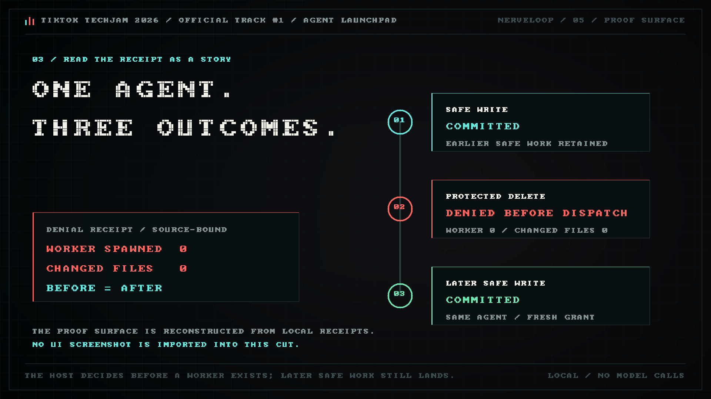

# NerveLoop

> **Remove the unsafe effect, not the useful agent.**

NerveLoop is lightweight middleware for **Track #1: Agent Launchpad: Design and Build Lightweight Agent Middleware** at TikTok TechJam 2026.

It extends the organizer-provided CodeJam Starter Kit rather than replacing its
agent lifecycle: the existing `AgentService` and Run flow remain the host seam,
while NerveLoop adds typed effect admission, one-use authority, an exact
cooperative sink, receipts, and bounded recovery around that flow.

Imagine an autonomous engineer that understands your repository, then proposes one unsafe next step. Today the blunt choices are often “trust it” or “kill the session.” NerveLoop adds a smaller, inspectable control surface underneath the planner.

Most agent safety demos end with a clean folder. That leaves an important question unanswered: did the dangerous action never run, or did it run and get repaired? NerveLoop makes those outcomes visibly different, and keeps the same Agent available for later safe work.



## The three-minute story

“The Kill Switch” is our demonstration scenario, not the official track name.

1. A normal Run completes, its exact cooperative write commits through the Effect Sink, and its work is retained.
2. On the same Agent, the fixed local fixture proposes `delete_mock_asset` against a `protected` target.
3. The **Effect Firewall** recomputes a typed policy decision before dispatch. It denies the proposal before the runner or worker starts.
4. The receipt records `workerSpawned: false`, worker dispatch `0`, `changedFiles: []`, an unchanged before-manifest equal to the after-manifest, and `recovery: not_needed`.
5. A separate admitted fault deliberately uses a raw ambient `.env` write. Its child closes unredeemed; **RunGuard**, the second-line post-run backstop, detects the drift and rolls the bounded checkpoint back.
6. The same-Agent later safe Run completes and is retained with a fresh cooperative sink write in the `committed` state.

Prevention, recovery and safe continuation are therefore separate facts, not one vague “safe” badge.

## How it works

```text
Agent proposal
      |
      v
exact typed effect parser
      |
      v
Effect Firewall ── deny ──> no worker ──> unchanged-state receipt
      |
     allow
      v
5-second, one-use parent capability
      |
      v
admitted worker + opaque child
      |
      v
exact cooperative Effect Sink
      |
      v
RunGuard ──> retain / restore / hold
      |
      v
same Agent continues
```

The policy is a closed monotone lattice over five operation classes and four target classes. Six cells are allowed and fourteen are denied. Moving toward a riskier operation or more sensitive target cannot turn a denial into an allow.

For an allowed deterministic demo effect, the host issues, claims and consumes a five-second parent capability bound to the exact Run, Agent, action, target class, policy name, policy version and full-policy digest. It attenuates that parent into one child bound to the canonical workspace identity, exact `demo-result.md` path, exact payload digest and expiry. A protected denial receives no capability at all.

The runner never receives the parent or any mint/inspect API. It receives an opaque child plus a redeem-only port, and the cooperative `demo-result.md` write spends that child at the sink. The host closes unredeemed or in-flight children when `runner.run` settles. Stored receipts expose a domain-separated grant digest, not the bearer.

This is process-local mediation for one exact cooperative fixture effect. It is not authentication, durable authority, provider-wide interception, ambient-filesystem removal, or OS/kernel isolation. Other writes in the same process can still bypass the sink; the deliberate raw `.env` fault exists to prove RunGuard catches and restores that second-line case.

[Architecture note](docs/judge/NERVELOOP-REFLEX-ARCHITECTURE.md) · [Judge playbook](docs/judge/VERA-JUDGE-PLAYBOOK.md)

## What improved

Six deterministic local rounds compared a blunt reset baseline, pre-dispatch Effect Firewall, and post-run RunGuard:

| Measured condition | Reset baseline | Effect Firewall | RunGuard |
|---|---:|---:|---:|
| Threat detection | 0% | 100% | 100% |
| Threat worker dispatch | 100% | 0% | 100% |
| First and later safe Runs retained | 0% | 100% | 100% |
| Logical recovery targets | 32 | 0 | 1 |
| Stale escapes | 0 | 0 | 0 |

The result is not “perfect security.” It is a causal improvement we can inspect: the Effect Firewall removes threat dispatch in this fixture while keeping later useful work; RunGuard reduces the recovery surface from 32 logical targets to one after an admitted fault.

The deeper adversarial suite also checked:

- all 20 policy cells and 130 comparable monotonicity relations;
- 30/30 malformed proposal shapes rejected;
- 24 prompt-confusable cases with no false or missed exact-fixture matches;
- 20/20 deliberately broken policy mutants killed; and
- 120 capability traces comprising 426 lifecycle operations matched against an independent state oracle.

See the exact local receipts: [functional flow](research/evidence/2026-09-01-track-c-functional-flow/current.json), [six-round comparison](research/evidence/2026-09-01-track-c-condition-benchmark/results.json), and [adversarial matrix](research/evidence/2026-09-01-effect-firewall-adversarial/results.json).

### The sink seam, integrated narrowly and attacked deeply

The product now uses the sink mechanism for the exact cooperative `demo-result.md` fixture write. Normal and later-safe Runs commit through it. An unredeemed child is closed when the runner settles by returning or throwing, or when receipt persistence fails; an in-flight child is closed if the runner returns without awaiting it. A direct ambient write is not blocked by this user-space port, so RunGuard still verifies and restores the terminal workspace.

Stop requests cancellation but does not itself revoke an already-issued child.
Host authority closes when `runner.run` settles. If closure wins first, delayed
redemption fails closed. A non-cooperative runner may redeem before settlement
or finish a redemption already awaiting I/O; the Run remains cancelled and its
output is withheld, but that exact policy-authorized write may commit.

A separate [source-bound reference lab](research/evidence/final-algorithm-lab/README.md)—not the product broker—stress-tests the same sink design contract. It rejected 32,767/32,767 envelope mutations and 63/63 request-context mutations with zero observed escapes. A 64-way concurrent redemption produced one write and 63 already-redeemed failures. One consumed parent could derive only one child; mutating the caller's buffer after validation did not change the snapshotted bytes written; exact expiry, a pre-existing destination symlink, and a deterministic pre-redemption workspace-root replacement all failed closed. An independent lifecycle oracle matched 120 traces and 426 operations.

Node's path-based APIs still leave concurrent ancestor-swap races outside this evidence. The result is cooperative, process-local mediation of one exact effect, not a hardened sandbox or general filesystem confinement.

```sh
node --test scripts/effect-sink-redemption-lab.test.mjs
```

## Run it locally

Prerequisites: Node.js 22+, npm 10+, and the locked dependencies restored with `npm ci`.

```sh
zsh scripts/start-local-judge-demo.zsh --check
zsh scripts/start-local-judge-demo.zsh
```

Open `http://127.0.0.1:5173/` and use the documented synthetic local token `nerveloop-local-judge-demo-2026`. It is not an account or provider credential. Follow the [five-step judge quickstart](docs/JUDGE_QUICKSTART.md).

The launcher binds both services to loopback and selects `DEMO_RUNNER=1`, a deterministic no-model fixture. Press `Ctrl+C` once to stop the two launcher-owned processes.

## Verify the public source contract

```sh
npm test -w @launchpad/server -- --run \
  src/effect-policy.test.ts src/effect-capability.test.ts \
  src/effect-sink.test.ts src/run-guard.test.ts src/agent-service.test.ts \
  src/effect-receipt-automaton.test.ts
node --test scripts/track-c-condition-benchmark.test.mjs
node --test scripts/effect-firewall-adversarial-matrix.test.mjs
node --test scripts/effect-sink-redemption-lab.test.mjs
npm run typecheck -w @launchpad/web
npm run build -w @launchpad/web
npm run submission:source-check
```

The exact no-video source selection is [TRACK1_PUBLIC_SOURCE_CLOSURE.txt](docs/TRACK1_PUBLIC_SOURCE_CLOSURE.txt). The local media-supplied rehearsal selection is [TRACK1_OPERATIONAL_CLOSURE.txt](docs/TRACK1_OPERATIONAL_CLOSURE.txt). Their limits and human publication gates are in the [release gate](docs/TRACK1_RELEASE_GATE.md).

## Project map

- `apps/server/src/effect-policy.ts`: typed parser and monotone Effect Firewall.
- `apps/server/src/effect-capability.ts`: one-use process-local capability lifecycle.
- `apps/server/src/effect-sink.ts`: one exact path/payload-bound cooperative write sink.
- `apps/server/src/agent-service.ts`: host-side admission before fixture dispatch.
- `apps/server/src/fixture-runner.ts`: no-model fixture that redeems only the opaque child.
- `apps/server/src/run-guard.ts`: checkpoint, verify, retain or restore.
- `apps/web/src/EffectFirewallStory.tsx`: judge-facing causal walkthrough.
- `scripts/run-track-c-kill-switch-demo.mjs`: functional normal → deny → rollback → safe sequence.
- `scripts/track-c-condition-benchmark.mjs`: three-condition comparison.
- `scripts/effect-firewall-adversarial-matrix.mjs`: lattice, parser and mutation checks.
- `scripts/effect-sink-redemption-lab.mjs`: adversarial sink-authority attenuation experiment.
- `scripts/verify-track1-final-readiness.mjs`: fail-closed source/media readiness contract.
- [Devpost draft](devpost-submission.md): human-readable project story and open gates.

## Proof boundary

This repository proves a deterministic local middleware fixture. It mediates one exact cooperative `demo-result.md` effect; it does not remove ambient filesystem authority, cover every effect, or confine a hostile process. No provider model runs in the flagship, so it is not model-backed safety or model-quality evidence. It is not a hardened sandbox, production-security or OS/kernel-isolation claim. It has no TikTok repository, data, API, service or production access. The benchmark is not a performance, latency, speed, compute, energy, GPU or cost comparison.

Both process-local authority registries are capped at 1,024 entries and do not yet reclaim terminal entries. Issuance fails closed at that ceiling, which makes this a demo availability limit rather than a production lifecycle design.

The current 139.875-second H.264/AAC candidate is local and machine-verified, but continuous human playback, public YouTube upload and Devpost completion remain separate gates. Its twelve scenes are generated as procedural pixel plates: the renderer imports no screenshots or images and does not resolve an operating-system font. It parses the vendored [`font8x8_basic.h`](research/evidence/2026-09-01-provenance-cleared-media-experiment/font8x8_basic.h) glyph table pinned to upstream commit `8e279d2d864e79128e96188a6b9526cfa3fbfef9`. The upstream project declares that table Public Domain; this repository records that declaration and its exact header hash, but does not claim an independent legal adjudication. The stable 159-second video is an older fallback that predates and does not reflect the final Effect Firewall-first story.

NerveLoop does not claim to invent reference monitors, capabilities or transaction recovery. Its contribution is their small, observable composition for long-horizon agents: deny a typed unsafe effect before dispatch, recover admitted drift after execution, and preserve the same Agent when later work is safe.

## License

MIT. See `LICENSE`.
